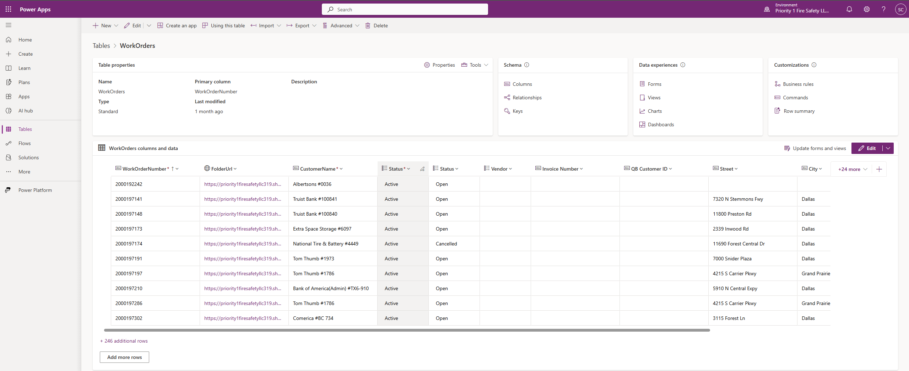
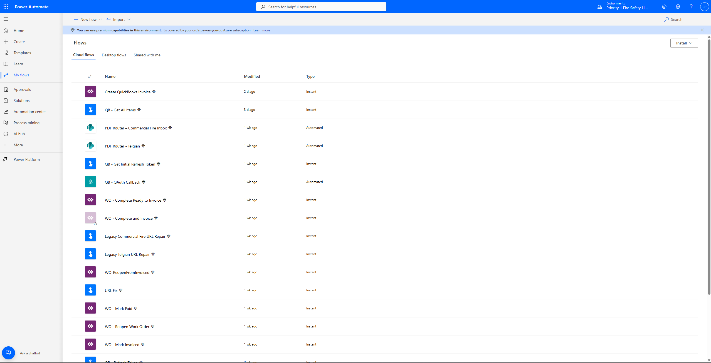
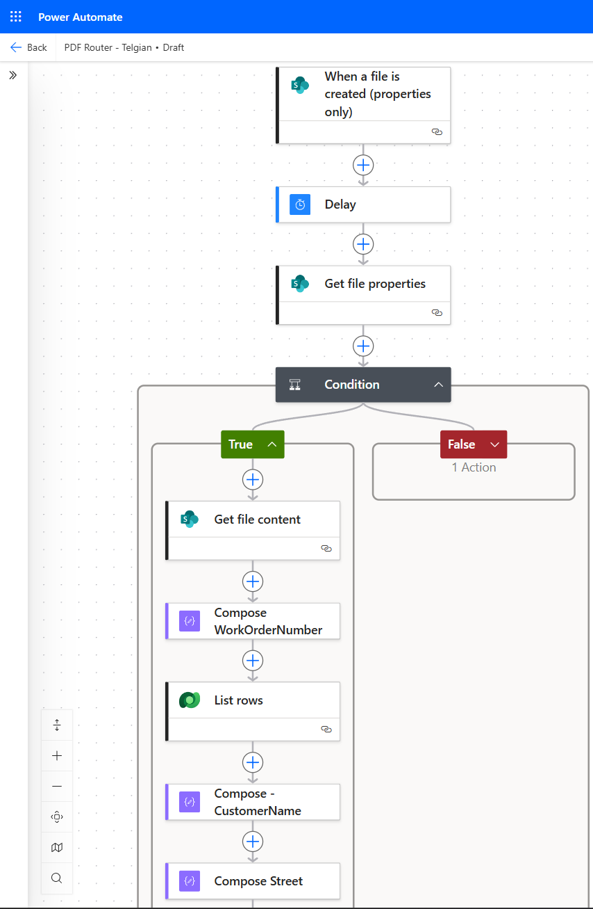
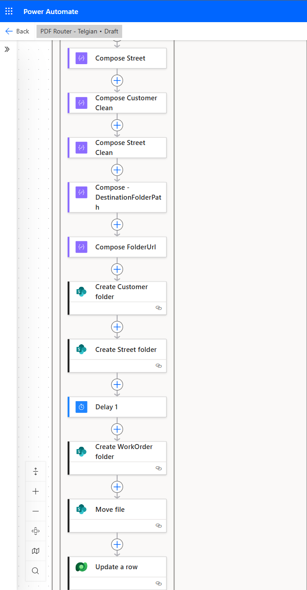
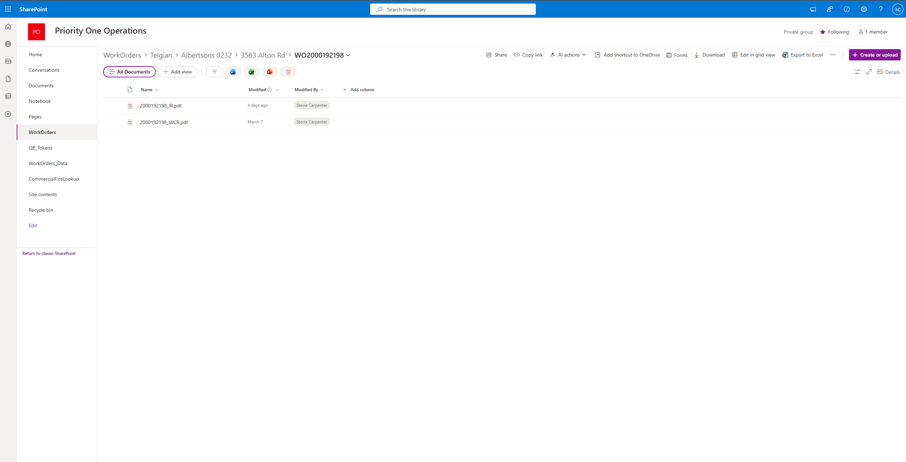
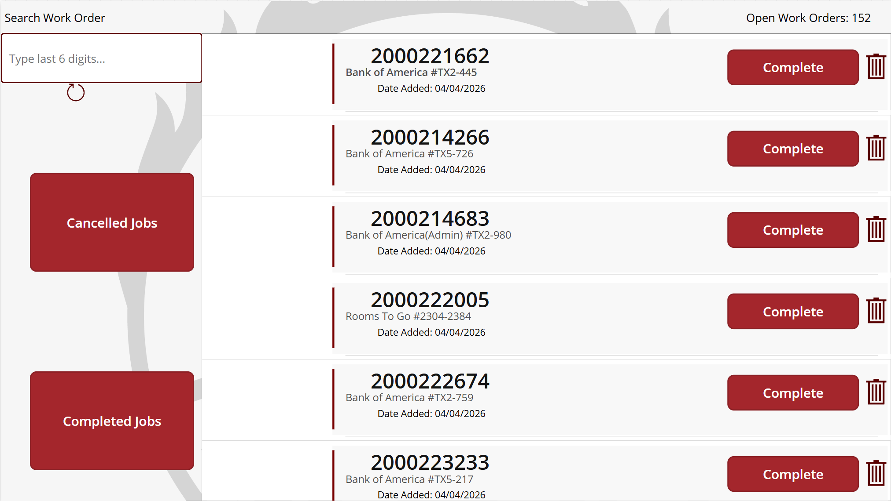
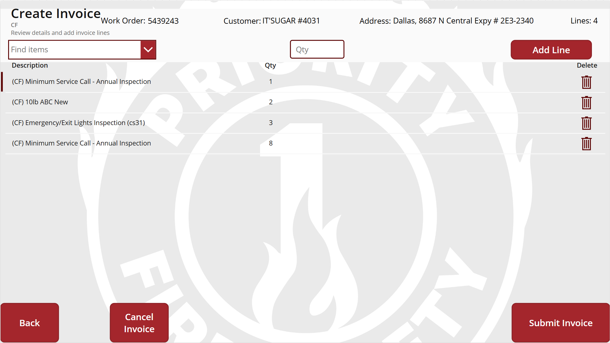

# Operations Automation System (Priority 1 Fire Safety)

Built an end-to-end automation system that reduced manual administrative work by ~60–80% and streamlined invoice processing for a fire safety company.

## Overview
Built using Power Apps, Power Automate, SharePoint, and QuickBooks API.

## Problem
Manual workflows caused delays, inconsistencies, and inefficiencies in handling work orders and invoices.

## Solution
Developed an automated system that:
- Routes vendor PDFs dynamically
- Extracts work order data
- Creates structured folders in SharePoint
- Tracks work orders in a centralized database
- Generates invoices through QuickBooks API

## System Workflow
Vendor PDF → SharePoint → Power Automate → Data Extraction → Folder Creation → Power App → Invoice → QuickBooks

## Tech Stack
- Power Apps
- Power Automate
- SharePoint
- QuickBooks API (OAuth)

## Screenshots
## System Architecture

### Power Apps (Data Model)

---

### Power Automate – Flow Overview

---

### Power Automate – Routing Logic (Top)

---

### Power Automate – Routing Logic (Bottom)

---

### SharePoint – Folder Structure

---

### Power Apps – Work Order Interface

---

### Power Apps – Invoice Interface

## Key Features
- Automated file routing
- Vendor detection logic
- Dynamic folder creation
- Invoice automation
- OAuth token management

## Business Impact
- Reduced manual work by ~60–80%
- Faster invoice turnaround
- Improved organization and scalability
